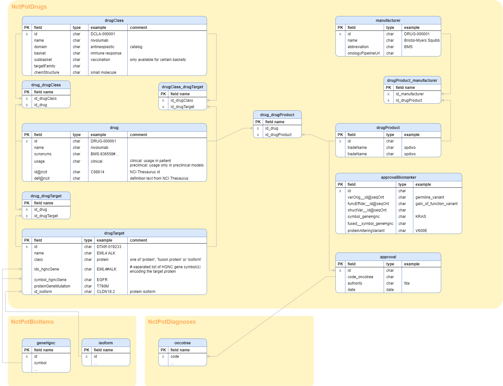

# NCT-POT Drugs

Part of the [**NCT Precision Oncology Thesaurus (NCT-POT)**](https://github.com/TMO-HD/NCT-POT).

## Summary

**NCT POT Drugs** is a data package covering **drug-related information** in the contxt of **precision oncology** workflows. It contains information about drugs, drug classes and drug targets, manufacturers and their drug products (trade names etc.), and approvals and approval-relevant biomarkers and appropriate diagnoses. Information is derived from a number of publicly available [**sources**](NCT_POT_Drugs#Sources_for_Assembly)**,** updated monthly and manually curated by a team of precision oncologists at the [**Divison of Translational Medical Oncology (TMO)**](https://www.dkfz.de/en/translationale-medizinische-onkologie/index.php) **at the** [**National Center for Tumor Diseases in Heidelberg**](https://www.nct-heidelberg.de/)**.** Data can be [**downloaded**](NCT_POT_Drugs#Download) free-of-charge under the [**CC-BY-NC 4.0 International license**](#License) **.**

> :warning: Though striving for best quality, **we cannot guarantee the absence of errors** or the lack of relevant information. The data is intended for application in a scientific context. It **must not be used for clinical decision-making** without decision verification by clinicians with appropriate experience in  precision oncology.

## Use Cases

NCT-POT Drugs must address frequent use cases like:

| Searching for | Example of request |
| --- | --- |
| **Drugs** | Search for all drugs targeting CLDN18.2, NECTIN4 or KRAS G12C |
| **Trials** | Search for all available clinical trials combining checkpoint inhibitors with FGFR2 inhibitors |
| **Evidence** | Search all available evidence in evidence databases (like CIVIC or OncoKB ) for efficacy of inhibitors of the PI3K/AKT/mTOR signaling pathway in colorectal cancer |
| **Approvals** | Are there drugs approved for NECTIN4-directed therapies in cervical cancer? |
| **Manufacturers** | Search for manufacturers suitable for a trial combining RAS/RAF/MEK/ERK pathway inhibitors with SHP2 inhibitors? |

## Entity relationship model

## Drug classes structure

The drug classes are a hierarchal taxonomy, self-maintained by the TMO  
and focusing on their usage in precision oncology workflows.

## Sources for assembly

| name | source url | content | comment | update cycle |
| --- | --- | --- | --- | --- |
| **NCI Thesaurus** | \<https://www.ebi.ac.uk/ols/ontologies/ncit\> | drug names, synonyms, drug targets | only (a subset of) nodes below NCIT\_C1909 ("Pharmacologic Substance") is used | monthly |
| **FDA Drugs** | \<https://www.fda.gov/drugs/drug-approvals-and-databases/drugsfda-data-files\> | drug names, trade names, approvals, approval docs |   | monthly |
| **NCT POT Drugs - drug classes** | \<https://github.com/TMO-HD/NCT-POT/tree/main/drugs\> | drug classes, drug class targets | self-maintained at NCT Heidelberg | continously |
| **NCT POT Drugs - manufacturer** | \<https://github.com/TMO-HD/NCT-POT/tree/main/drugs\> | manufacturer | self-maintained at NCT Heidelberg | continously |

## Data curation process

To be added

## Roadmap

| Date | Task |
| --- | --- |
| 2022-10-18 | Upload of initial data sample |
| 2022-10-21 | Completion of documentation on Github |
|   | Addition of more approval taggings |
|   | Addition of Onkostar© XML catalog files to read data catalogs in the [Onkostar©](https://www.onkostar.de/) tumor documentation platform |
| 2022-10-end | Completion of the approvals' biomarker end entity tagging. |
|   | Addition of EMA approvals |
| monthly | Updates from sources |
| continously | Manual curation |

## Download

**NCT POT Drugs** is released monthly.

| Date | RData | CSV | Onkostar® | Stats |
| --- | --- | --- | --- | --- |
| 2022-10-18 | Upload planned for 2022-10-18 | Upload planned for 2022-10-18 | Upload planned | Upload planned for 2022-10-18 |

## License

NCT POT Drugs is released under the [**CC-BY-NC 4.0 International license**](https://creativecommons.org/licenses/by-nc/4.0/) and is free-of-charge usable in a non-commercial environment. 

Please send us a short [**mail**](Mailto:simon.kreutzfeldt@nct-heidelberg.de) if you intend to use the content of NCT-POT drugs.

## Feedback

We are happy about any kind of feedback! 🙂

Please report via [**mail**](Mailto:simon.kreutzfeldt@nct-heidelberg.de) or in the [**issues section**](https://github.com/TMO-HD/NCT-POT/issues) on Github.

## Publications

*   Simon Kreutzfeldt, Alexander Knurr, Daniel Hübschmann, Peter Horak, Stefan Fröhling, **NCT Precision Oncology Thesaurus Drugs – a Curated Database for Drugs, Drug Classes, and Drug Targets in Precision Cancer Medicine**; medRxiv 2022.09.11.22279783; doi: [doi.org/10.1101/2022.09.11.22279783](https://doi.org/10.1101/2022.09.11.22279783)
